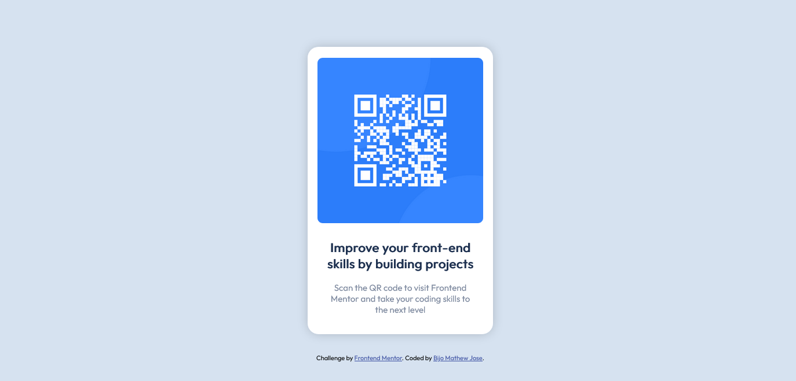

# Frontend Mentor - QR code component solution

This is a solution to the [QR code component challenge on Frontend Mentor](https://www.frontendmentor.io/challenges/qr-code-component-iux_sIO_H). Frontend Mentor challenges help you improve your coding skills by building realistic projects. 

## Table of contents

- [Overview](#overview)
  - [Screenshot][def]
  - [Links](#links)
- [My process](#my-process)
  - [Built with](#built-with)
  - [What I learned](#what-i-learned)
  - [Continued development](#continued-development)
  - [Useful resources](#useful-resources)
- [Author](#author)
- [Acknowledgments](#acknowledgments)

**Note: Delete this note and update the table of contents based on what sections you keep.**

## Overview

### Screenshot

### Links

- Solution URL: [https://github.com/bijomathewjose/qr-code-component-main](https://github.com/bijomathewjose/qr-code-component-main)
- Live Site URL: [https://bijomathewjose.github.io/qr-code-component-main/](https://bijomathewjose.github.io/qr-code-component-main/)

## My process

### Built with

- Semantic HTML5 markup
- CSS custom properties
- Flexbox

## Author

<<<<<<< HEAD
- Frontend Mentor - [@bijomathewjose](https://www.frontendmentor.io/profile/bijomathewjose)
- Twitter - [@bijomathewjose](https://www.twitter.com/bijomathewjose)
=======
- Website - [Add your name here](https://www.your-site.com)
- Frontend Mentor - [@bijomathewjose](https://www.frontendmentor.io/profile/yourusername)
- Twitter - [@yourusername](https://www.twitter.com/yourusername)

**Note: Delete this note and add/remove/edit lines above based on what links you'd like to share.**

## Acknowledgments

This is where you can give a hat tip to anyone who helped you out on this project. Perhaps you worked in a team or got some inspiration from someone else's solution. This is the perfect place to give them some credit.

**Note: Delete this note and edit this section's content as necessary. If you completed this challenge by yourself, feel free to delete this section entirely.**

>>>>>>> b62bb9b472fbae0d017dbf457bc73b79eeea85eb

[def]: #screenshot
